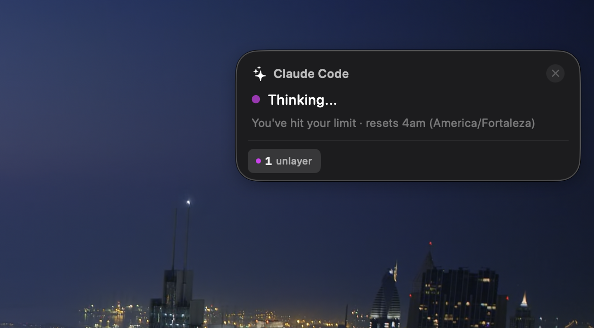

# Claude Code Floating Live Activity

A floating macOS pill that shows what Claude Code is doing in real time -- like an iOS Live Activity, but for your desktop.



## Features

- Floating dark pill UI pinned to your screen (draggable, position persists)
- Real-time status: tool use, thinking, waiting, done
- Latest Claude message from the conversation transcript
- Multi-session tabs (supports multiple Claude Code instances)
- Click to focus the matching Terminal tab
- Menu bar toggle to show/hide

## Install

Requires macOS 13+ and Swift (Xcode Command Line Tools).

Copy the prompt below and paste it into [Claude Code](https://docs.anthropic.com/en/docs/claude-code):

```
Clone https://github.com/brunolemos/claude-code-floating-live-activity.git to a temp directory,
run `bash install.sh`, then delete the cloned directory.
```

This builds the app, installs Claude Code hooks, and sets up auto-start on login.

## Uninstall

```
Clone https://github.com/brunolemos/claude-code-floating-live-activity.git to a temp directory,
run `bash uninstall.sh`, then delete the cloned directory.
```

## How it works

The install script configures [Claude Code hooks](https://docs.anthropic.com/en/docs/claude-code/hooks) that write session status to `~/.claude/live-sessions/`. The menu bar app watches this directory and displays a floating pill with live updates. It also tails the conversation transcript for Claude's text messages.

## Author

[@brunolemos](https://x.com/brunolemos) on X

<a href="https://x.com/brunolemos"></a>

## License

MIT
